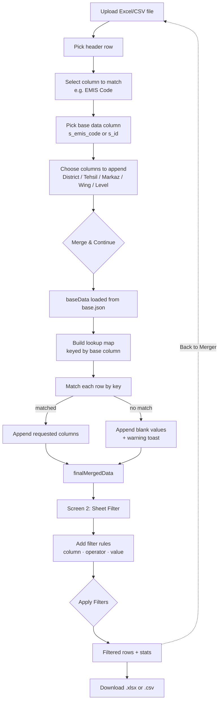

# SheetFilter Wizard

A two-step, client-side PWA for Punjab school data:

1. **Data Merger** — upload an Excel/CSV file, match it against a base dataset of schools (by EMIS code or School ID), and append administrative columns (District, Tehsil, Markaz, Wing, Level).
2. **Sheet Filter** — build filter rules (AND/OR) against the merged data, preview matching rows, and export the result as `.xlsx` or `.csv`.

Everything runs entirely in the browser. No file ever leaves the device — there is no backend and no upload endpoint.

**Live app:** https://sheerazautomate.github.io/filter/

---

## How it works



## Project structure

```
filter/
├── index.html      Two-screen app shell (Merger + Filter)
├── app.js           Merge engine + filter/results/download engine
├── style.css        Glass/futuristic theme
├── base.json         Base school records (District/Tehsil/Markaz/Wing/Level, keyed by s_emis_code / s_id)
├── manifest.json     PWA manifest (installable, share-target support)
├── sw.js             Service worker — offline caching + share-target file intake
├── _headers          Content-type headers for GitHub Pages / Cloudflare Pages
└── icon-192.png, icon-512.png
```

## Data merge logic

- Matching is **strict-string**: both the uploaded column's cell values and the base column's values are coerced to trimmed strings before lookup, so `32210140` and `"32210140"` match reliably regardless of Excel's number formatting.
- Unmatched rows are kept in the output (not dropped) — appended columns are left blank and a warning toast reports how many rows failed to match.
- The merge is non-destructive: the original uploaded sheet is deep-cloned before appending, so re-running a merge never mutates previously read data.

## Filtering

Filter operators: `contains`, `does not contain`, `equals`, `not equals`, `starts with`, `ends with`, `>`, `<`, `>=`, `<=`, `is empty`, `is not empty`, combinable with AND/OR logic across multiple rules.

Downloads use a smart auto-generated filename built from the source filename and active filter rules (e.g. `sample_d_name_LAYYAH.xlsx`), editable before download.

## Running locally

No build step — it's static HTML/CSS/JS plus SheetJS (loaded from CDN).

```bash
npx serve .
# or
python3 -m http.server 8000
```

Then open `http://localhost:8000` (or `:8000` for the Python server).

## Scope note

`base.json` currently contains only District Layyah school records. Matching against schools outside that district will always fail (they'll come through as unmatched rows with blank appended columns).

## Tech

- [SheetJS](https://github.com/SheetJS/sheetjs) for Excel/CSV parsing and export
- Vanilla JS, no framework, no build tooling
- PWA: installable, offline-capable via service worker, supports receiving files via the OS share sheet
